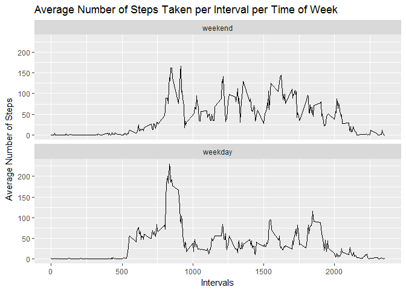

# Programming Assignment 1

## Introduction
The purpose of this assignment is to conduct data analysis with the following data set: "Activity.csv" (Link: https://d396qusza40orc.cloudfront.net/repdata%2Fdata%2Factivity.zip)

The above data set contains the following 3 variables:

**steps:** Number of steps taking in a 5-minute interval (missing values are coded as **NA**)  
**date:** The date on which the measurement was taken in YYYY-MM-DD format  
**interval:** Identifier for the 5-minute interval in which measurement was taken   

Throughout our data analysis, we will load and preprocess the data, calculate the mean total number of steps taken per day, explore the average daily activity pattern, imput missing values, and explore the difference in activity patterns between weekdays and weekends.

## Loading and preprocessing the data

First, we will load the necessary libraries required for our data analysis

```r
library(dplyr)
library(ggplot2)
library(plyr)
library(Hmisc)
```
  
  
After loading the necessary libraries, we will navigate to the directory that contains our data file.

```r
setwd("C:\\Users\\574996\\Desktop\\R_Assignments\\Activity_Monitoring_data")
```
  
  
Once we are at the directory, we will read in the dataset

```r
activityData <- read.csv("activity.csv", header = TRUE)
```

After reading in the data set, we will convert our object 'activityData' into a data table

```r
activityDataTable <- tbl_df(activityData)
```


## What is the mean total number of steps taken per day?

First, we will remove all null values from our data table

```r
activityDataTable0 <- activityDataTable[complete.cases(activityDataTable), ]
```

After removing the null values, we will calculate the total number of steps taken per day

```r
TotalStepsPerDay <- aggregate(activityDataTable0[, "steps"], by=list(activityDataTable0$date), sum)
```

Our calculation created a new object "TotalStepsPerDay". We will rename the columns of that object

```r
colnames(TotalStepsPerDay) <- c("date","totalsteps")
```

Using ggplot2, we will create a histogram of the total number of steps per day

```r
qplot(TotalStepsPerDay$totalsteps, data = TotalStepsPerDay, main = "Total Steps per Day Histogram", xlab = "Total Steps per Day")
```

<!-- -->

Finally, we will calculate and report the mean and median of the total number of steps taken per day

```r
summary(TotalStepsPerDay)
```

```
##          date      totalsteps   
##  2012-10-02: 1   Min.   :   41  
##  2012-10-03: 1   1st Qu.: 8841  
##  2012-10-04: 1   Median :10765  
##  2012-10-05: 1   Mean   :10766  
##  2012-10-06: 1   3rd Qu.:13294  
##  2012-10-07: 1   Max.   :21194  
##  (Other)   :47
```
PLEASE NOTE: Based on the above output, we see that the **mean** is **10766** and that the **median** is **10765**


## What is the average daily activity pattern?

First, we will calculate the average number of steps per interval

```r
AverageStepsPerInterval <- aggregate(activityDataTable0[, "steps"], by=list(activityDataTable0$interval), mean)
```

Our calculation created a new object "AverageStepsPerInterval". We will rename the columns of that object

```r
colnames(AverageStepsPerInterval) <- c("interval","averagesteps")
```

Using ggplot2, we will create a a time-series plot of the average number of steps per interval

```r
ggplot(AverageStepsPerInterval,aes(interval,averagesteps)) + geom_line() + ggtitle("Average Number of Steps Taken per Interval") + xlab("Intervals") + ylab("Average Number of Steps")
```

<!-- -->

Finally, we will find the 5-minute interval, on average across all days in the data table, that contains the maximum number of steps

```r
AverageStepsPerInterval[which.max(AverageStepsPerInterval$averagesteps), ]
```

```
##     interval averagesteps
## 104      835     206.1698
```
PLEASE NOTE: Based on the above output, we see that the 5-minute interval that contains the maximum number of steps is **835**  


## Imputting missing values

First, we will calculate and report the total number of missing values (NAs) in our data table

```r
sum(is.na(activityDataTable))
```

```
## [1] 2304
```
PLEASE NOTE: Based on the above output, we see that there are **2304** missing values in our data table

In order to fill in the null/missing values in our data table, we will replace them with the means of each respective 5-minute interval

```r
activityDataTable1 <- ddply(activityDataTable, "interval", mutate, imputed.value = impute(steps, mean))
```

Our calculation created a new object "activityDataTable1". We will rename the columns of that object

```r
colnames(activityDataTable1) <- c("steps","date","interval","imputtedsteps")
```

Next, with our object "activityDataTable1", we will calculate the total number of steps taken per day

```r
TotalImputtedStepsPerDay <- aggregate(activityDataTable1[, "imputtedsteps"], by=list(activityDataTable1$date), sum)
```

Our calculation created a new object "TotalImputtedStepsPerDay". We will rename the columns of that object

```r
colnames(TotalImputtedStepsPerDay) <- c("date","totalimputtedsteps")
```

Using ggplot2, we will create a histogram of the total number of steps per day

```r
qplot(TotalImputtedStepsPerDay$totalimputtedsteps, data = TotalImputtedStepsPerDay, main = "Total Steps per Day Histogram", xlab = "Total Steps per Day")
```

<!-- -->

Finally, we will calculate and report the mean and median of the total number of steps taken per day

```r
summary(TotalImputtedStepsPerDay)
```

```
##          date    totalimputtedsteps
##  2012-10-01: 1   Min.   :   41     
##  2012-10-02: 1   1st Qu.: 9819     
##  2012-10-03: 1   Median :10766     
##  2012-10-04: 1   Mean   :10766     
##  2012-10-05: 1   3rd Qu.:12811     
##  2012-10-06: 1   Max.   :21194     
##  (Other)   :55
```
PLEASE NOTE: Based on the above output, we see that the **mean** is **10766** and that the **median** is **10766**. By imputting the missing values, we see that the **mean remains the same** and that the **median increased by 1**


## Are there differences in activity patterns between weekdays and weekends

First, we will need to convert the class of the "date" variable in the "activityDataTable1" to the class "Date"

```r
activityDataTable1$date <- as.Date(activityDataTable1$date, format = "%Y-%m-%d")
```

Next, we will create a vector, 'dayOfWeek', which specifies the day of the week of each date in the 'activityDataTable1' data framw

```r
dayOfWeek <- weekdays(activityDataTable1$date)
```

Using the 'dayOfWeek' vector, we will create a new column in "activityDataTable1" data table called "timeofweek", which is a factor variable that indicates whether the day of the week is a weekday or a weekend

```r
activityDataTable1$timeofweek <- factor(dayOfWeek %in% c('Saturday','Sunday'), levels = c(TRUE,FALSE), labels = c('weekend','weekday'))
```

Next, we will calculate the average number of steps taken per 5-minute interval, average acroos all weekday days and weekend days

```r
AverageStepsPerIntervalPerTimeOfWeek <- aggregate(activityDataTable1[, "imputtedsteps"], by=list(activityDataTable1$interval, activityDataTable1$timeofweek), mean)
```

Our calculation created a new object "AverageStepsPerIntervalPerTimeOfWeek". We will rename the columns of that object

```r
colnames(AverageStepsPerIntervalPerTimeOfWeek) <- c("interval","timeofweek","averageimputtedsteps")
```

Using ggplot2, we will create a time-series plot of the 5-minute interval (x-axis) and the average number of steps taken, averaged across all weekday days or weekend days (y-axis)

```r
ggplot(AverageStepsPerIntervalPerTimeOfWeek,aes(interval,averageimputtedsteps)) + geom_line() + facet_wrap(~ timeofweek, ncol = 1) + ggtitle("Average Number of Steps Taken per Interval per Time of Week") + xlab("Intervals") + ylab("Average Number of Steps")
```

<!-- -->


